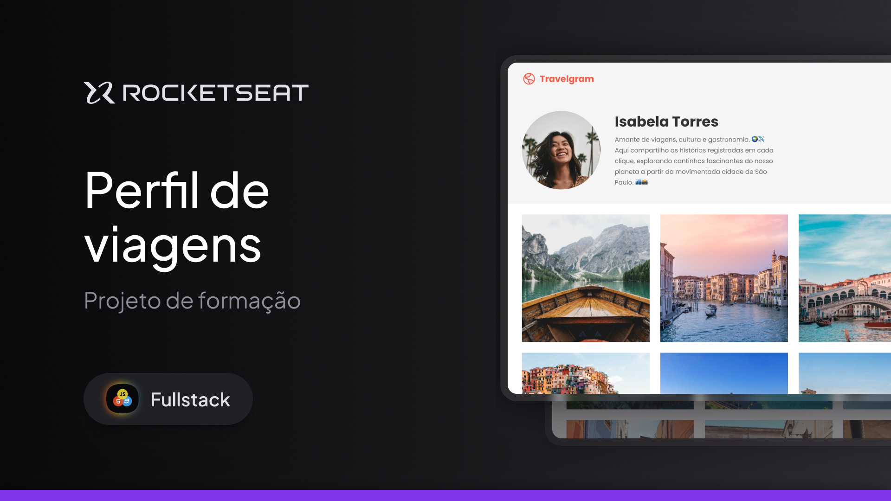

<h1 align="center"> Perfil de Viagens  </h1>

Layout do perfil de uma rede social de fotos de viagens! ✈️ 
Esse é um dos projetos desenvolvidos em aula na formação Full-stack, dentro dos conteúdos de especialização.

  <a href="#-tecnologias">Tecnologias</a>&nbsp;&nbsp;&nbsp;|&nbsp;&nbsp;&nbsp;
  <a href="#-projeto">Projeto</a>&nbsp;&nbsp;&nbsp;|&nbsp;&nbsp;&nbsp;
  <a href="#-layout">Layout</a>&nbsp;&nbsp;&nbsp;|&nbsp;&nbsp;&nbsp;
  <a href="#memo-licença">Licença</a>

  

 

  

## 🚀 Tecnologias

Esse projeto foi desenvolvido com as seguintes tecnologias:

- HTML e CSS
- Git e Github
- Figma

## 💻 Projeto

Um layout do perfil de uma rede social de fotos de viagens, o "Travelgram". Nele está contido tanto informações pessoais do viajante, quanto registros sobre as viagens feitas. Um dia chegarei ao nível da Isabela! 😅

## 🔖 Layout

Você pode visualizar o layout do projeto através [DESSE LINK](https://www.figma.com/design/BEjkgLowSxtPMkSTZjNo2m/Perfil-de-viagens-(Community)?m=auto&t=Zxp2InIDUNlMYkj4-6). É necessário ter conta no [Figma](https://figma.com) para acessá-lo.

## :memo: Licença

Esse projeto está sob a licença MIT.

---

Feito com ♥ by Arthur Costa :wave:
